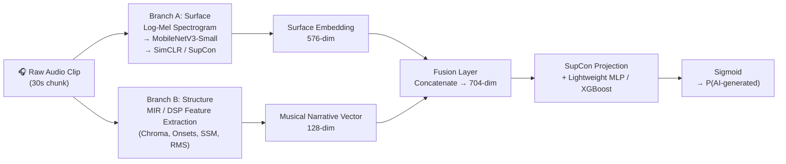
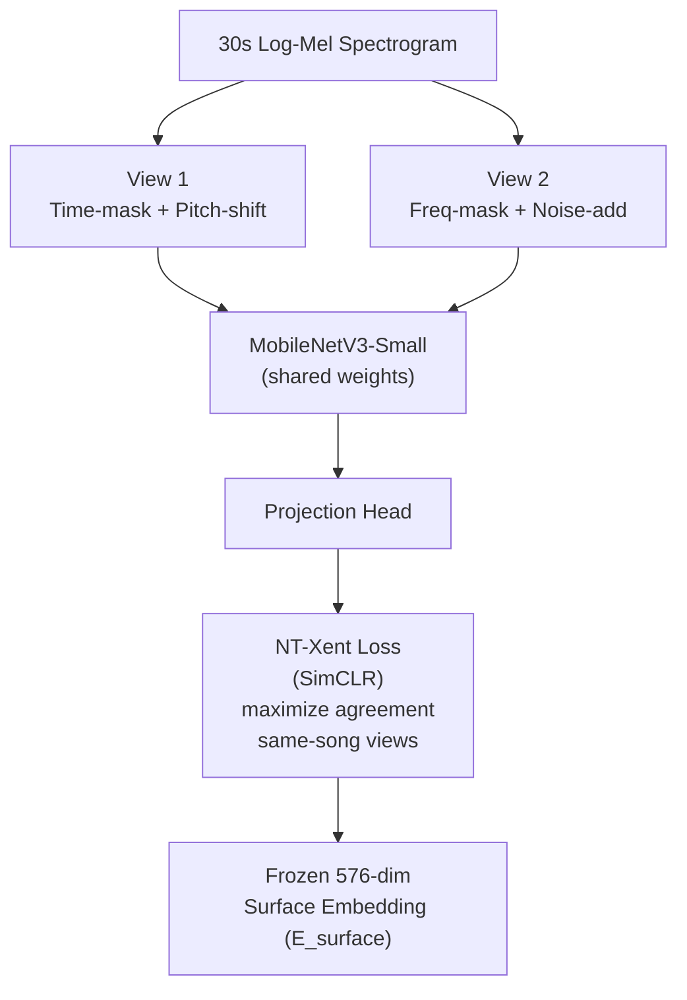
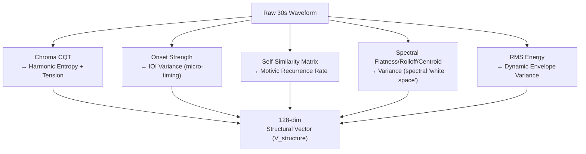
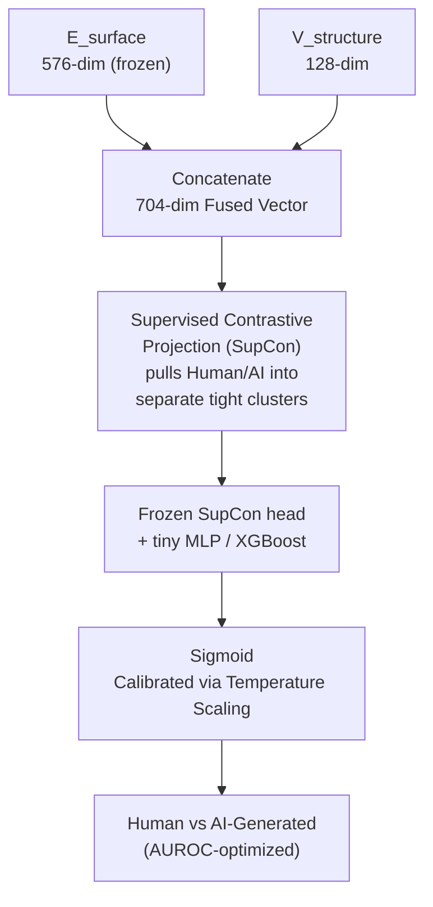
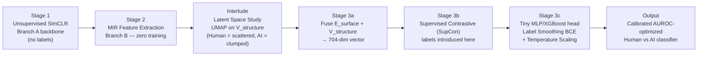

#MusicScope-CL

**Detecting AI-Generated Music by fusing Contrastive Surface Learning with Structural "Narrative Logic."**

MusicScope-CL is our submission architecture for **MIREX 2026 — AI-Generated Music Detection**. It's directly inspired by **StoryScope**, an NLP paper whose core insight was:

> Surface-level style (word choice, syntax) is easy for AI to fake. Deep narrative structure (plot causality, thematic development, non-linear time) is where AI still fails to mimic human creativity.

We translate that philosophy into audio, then go one step further: instead of relying on a single detection signal, we build a **dual-layer defense** by combining two branches that fail independently:

| Branch | What it learns | Method |
|---|---|---|
| **Branch A — Surface** | Vocoder artifacts, phase smearing, spectral physics of "real" recording | **Contrastive Learning (SimCLR → SupCon)** on log-Mel spectrograms |
| **Branch B — Structure** | Harmonic tension, motif development, rhythmic groove, dynamic arcs | **MIR / DSP feature extraction** (`librosa` / `essentia`) |

AI generators can learn to hide their surface artifacts (Branch A's job), or — in theory — get better at structural coherence (Branch B's job). But beating **both at once** is far harder. That's the whole bet of this architecture.

---

## Core Idea



---

## The Rosetta Stone: Text Narrative → Music Structure

The conceptual translation table the structural branch is built on.

| StoryScope (Text) | MusicScope (Audio) | The AI "Tell" |
|---|---|---|
| Thematic Explicitness | Motivic Development | AI loops perfectly; humans vary and develop motifs |
| Chronological Discontinuity | Structural Transitions & Form | AI fades in/out; humans use fills, drops, harmonic pivots |
| Moral Ambiguity | Harmonic & Rhythmic Tension | AI resolves cleanly (I–IV–V–I); humans use dissonance, swing |
| Sensory Density | Timbral Clutter / Spectral Density | AI fills all frequency bands; humans leave "space" |
| Narrative Rarity | Dynamic Arc Rarity | AI's loudness curve is flat/linear; humans shape it non-linearly |

---

##  Full Architecture Blueprint — Three Stages

### Stage 1: Unsupervised Contrastive Pre-Training (the "Surface Eye")

Learns robust audio textures **without ever touching a label** — this is what protects the model from the noisy labels in a 500GB scraped dataset.



### Stage 2: MusicScope MIR Feature Extraction (the "Structural Ear")

Pure signal processing. **No neural network, no training** — the same Track-A pipeline as before.



### Stage 3: Supervised Contrastive Fusion & Classification (the "Decision Brain")

This is where labels finally enter the pipeline — and instead of plain cross-entropy, we use **SupCon** to pull all Human tracks into one tight cluster and push all AI tracks into another, maximizing the margin between classes (directly maximizing AUROC).



---

##  Branch Details

### Branch A — Surface (Contrastive Learning)

- **Input:** 128-band log-Mel spectrogram, 30s chunks.
- **Backbone:** MobileNetV3-Small (HardSwish + SE-Attention), ~2.5M params.
- **Stage 1 algorithm:** SimCLR — two augmented views per clip (time-mask + pitch-shift vs. freq-mask + noise-add), trained with NT-Xent loss to maximize agreement between views of the same track and minimize it across different tracks. **No labels used.**
- **Stage 3 algorithm:** SupCon — once frozen, the embedding feeds into a supervised contrastive projection that now *does* use labels, explicitly clustering Human vs. AI representations rather than just drawing a thin decision boundary.

### Branch B — Structure (MIR / DSP)

All features are computed with `librosa` / `essentia` — zero training required.

1. **Harmonic Ambiguity & Tension** — `librosa.feature.chroma_cqt` → harmonic entropy + bass/root dissonance curve.
   *Tell:* AI stays rigidly in-key (low entropy); humans use modal mixture and borrowed chords.
2. **Rhythmic Micro-Deviation** — `librosa.onset.onset_strength` → Inter-Onset Interval (IOI) variance.
   *Tell:* AI is grid-quantized (near-zero variance); humans have groove/swing (high variance).
3. **Motivic Repetition vs. Development** — Self-Similarity Matrix over chroma/mel → recurrence rate.
   *Tell:* AI loops the same 4 bars; humans develop themes (low recurrence, high structural variance).
4. **Spectral "White Space"** — Spectral flatness, rolloff, centroid variance over time.
   *Tell:* AI vocoders smear energy across all bands; human mixes leave dynamic space.

---

## Experimental Plan / Pipeline



**Hypothesis (Interlude):** UMAP projection of structural vectors will show human tracks scattered widely (high structural rarity), while AI tracks cluster tightly ("AI convergence").

**Why labels are introduced this late:** Stage 1 (SimCLR) and Stage 2 (MIR) never touch a label, so the representations they learn can't be corrupted by noisy labels in the 500GB dataset. Labels only shape the final decision boundary in Stage 3, once the backbone is frozen — this contains the blast radius of any label noise to the cheapest, fastest-to-retrain part of the pipeline.

---

## The "Uncanny Valley" Trap — Why Two Branches Beat One

| Scenario | Branch A (Surface/CL) | Branch B (Structure/MIR) | Verdict |
|---|---|---|---|
| AI track with a new vocoder that hides surface artifacts | ❌ Might be fooled | ✅ Still lacks human micro-timing & harmonic tension | Caught |
| AI track engineered with complex, non-linear structure to fool structural detectors | ✅ Still detects phase discontinuities & spectral smearing | ❌ Might be fooled | Caught |
| Human track, poorly recorded, messy playing/structure | ✅ Recognizes natural, un-synthesized acoustic physics | ❌ Might flag as "weird" | Correctly kept as Human |

Beating one branch is plausible for a generator. Beating both simultaneously, with no shared blind spot, is a much higher bar.

---

## Ablation Plan (MIREX Technical Report)

| Model Variant | Branch A (Surface/CL) | Branch B (Structure/MIR) | Fusion | Expected AUROC | Inference Speed |
|---|---|---|---|---|---|
| Baseline | ❌ | ❌ | — | Low | Very Fast |
| Surface Only | ✅ SimCLR | ❌ | — | Medium | Fast |
| MusicScope Only | ❌ | ✅ MIR | — | Medium | Fast |
| Fused (no SupCon) | ✅ | ✅ | Concat + plain CE | High | Fast |
| **MusicScope-CL (Ours)** | ✅ | ✅ | Concat + **SupCon** | **Highest** | Fast |

This table is designed to give a mathematically rigorous, paper-ready justification: Surface + Structure beats either alone, and Supervised Contrastive fusion beats plain linear fusion — echoing StoryScope's own findings, adapted to audio.

---

##  Why This Wins MIREX 2026

- **Solves the noisy-label problem:** Unsupervised pretraining (Stage 1) and label-free DSP (Stage 2) mean the representations are shaped before any noisy label is seen. Labels only touch the final, cheap-to-retrain fusion stage.
- **Dual-layer defense, no shared blind spot:** See the Uncanny Valley table above — an AI generator has to simultaneously fool surface texture *and* structural logic, which is a much harder bar than fooling either alone.
- **SupCon maximizes margin, which maximizes AUROC:** Rather than a thin cross-entropy decision boundary, SupCon explicitly clusters Human vs. AI in embedding space, directly targeting the metric MIREX evaluates on.
- **Lightweight & fast:** MobileNetV3-Small (~2.5M params) + millisecond-level DSP feature extraction + a tiny fusion head → comfortably fits the 24-hour, single-GPU MIREX constraint, with headroom to run **Multiple Instance Learning at inference** (slice each test song into three 30s chunks, average the scores) for an extra AUROC boost.

---

##  Repo Structure

```
musicscope/
├── README.md                  # this file
├── ARCHITECTURE.md            # deep-dive on design decisions
├── requirements.txt           # dependencies
├── src/
│   ├── track_a_narrative.py   # Branch B: MIR/DSP structural feature extractor
│   ├── track_b_style.py       # Branch A: MobileNetV3 spectrogram encoder
│   ├── train_simclr.py        # Stage 1: unsupervised contrastive pretraining
│   ├── train_supcon.py        # Stage 3b: supervised contrastive fusion
│   ├── fusion_model.py        # Stage 3c: MLP/XGBoost classification head
│   └── umap_analysis.py       # Interlude: latent space visualization
├── notebooks/
│   └── exploration.ipynb
└── data/
    └── README.md              # dataset notes (not tracked in git)
```

---

## Quickstart

```bash
git clone https://github.com/https://github.com/isdp0415-droid/musicscope.git
cd musicscope
pip install -r requirements.txt

# Stage 2: extract structural features (no training needed)
python src/track_a_narrative.py --input_dir ./data/raw --output narrative_vectors.parquet

# Stage 1: unsupervised contrastive pretraining of the surface branch
python src/train_simclr.py --input_dir ./data/raw

# Stage 3b: supervised contrastive fusion (labels introduced here)
python src/train_supcon.py --narrative narrative_vectors.parquet --style_ckpt simclr.pt

# Stage 3c: train the final lightweight classification head
python src/fusion_model.py --narrative narrative_vectors.parquet --style_ckpt simclr.pt --supcon_ckpt supcon.pt
```

---

##  Citation / Inspiration

This project's methodology is adapted from the **StoryScope** paper's approach to AI-text detection via narrative-structure features, reapplied to the audio domain via Music Information Retrieval (MIR) techniques, and extended with Contrastive Learning (SimCLR + SupCon) for the surface-texture branch.

---

## 🗒️ Status

🚧 Active development for MIREX 2026 submission. Contributions and issue reports welcome.
